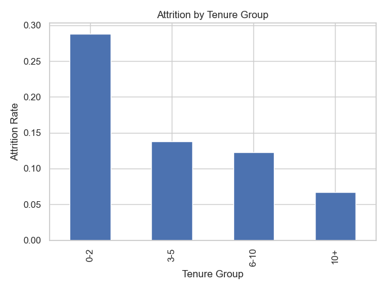
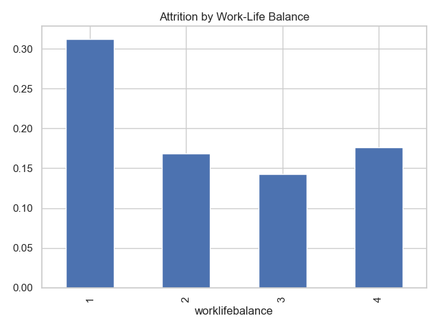
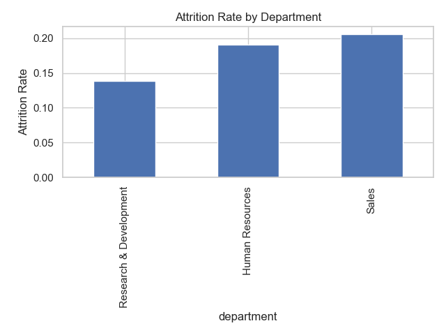
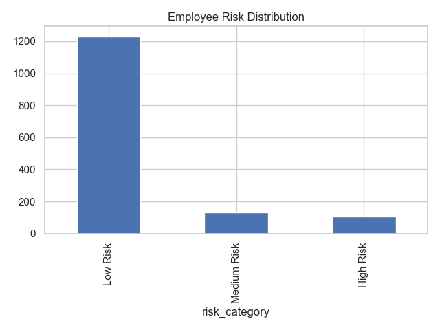

# Executive Summary: HR Workforce Analytics

## Objective

Analyze employee attrition patterns to identify key drivers of turnover and provide actionable recommendations to improve retention.

---

## Key Findings

### 1. Early Tenure Attrition Risk

Employees with less than 2 years at the company show the highest attrition rates (~29%).

* This suggests onboarding, early engagement, or expectation misalignment issues.

---

### 2. Work-Life Balance Drives Retention

Employees with lower work-life balance scores are significantly more likely to leave.

* Indicates a strong relationship between employee well-being and retention.

---

### 3. Department-Level Variability

Certain departments exhibit elevated attrition rates compared to others.

* Points to potential management, workload, or role-specific challenges.

---

## Business Impact

* High attrition increases recruiting and training costs
* Loss of experienced employees impacts productivity
* Early attrition reduces ROI on hiring investments

---

## Recommendations

### 1. Improve Early Employee Experience

* Strengthen onboarding programs
* Implement 90-day and 6-month check-ins

### 2. Address Work-Life Balance

* Evaluate workload distribution
* Expand flexible work policies

### 3. Target High-Risk Departments

* Conduct deeper analysis on specific teams
* Partner with managers to identify root causes

### 4. Predictive Attrition Risk

A machine learning model was developed to assign an attrition risk score to each employee.

* This allows proactive retention strategies instead of reactive analysis.

---

## Next Steps

* Integrate dashboard into HR decision workflows
* Continuously monitor attrition trends over time
